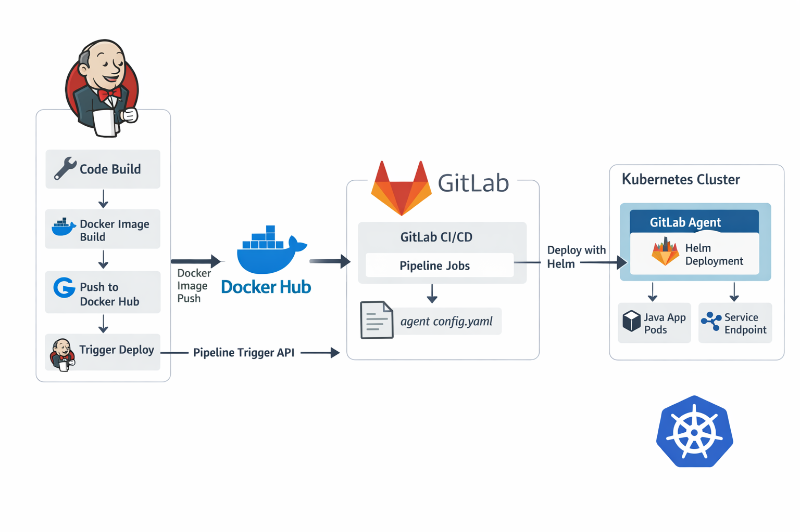

# 🚀 Java CI/CD Pipeline with Jenkins, Docker Hub & GitLab Kubernetes

This project demonstrates a complete **end-to-end CI/CD pipeline** for a Java web application using modern DevOps tools.

---

## 📊 Architecture Diagram



---

## 🧠 Project Overview

This project implements a full DevOps workflow:

1. Developer pushes code to GitHub
2. Jenkins automatically triggers the CI pipeline
3. Application is built, tested, and analyzed
4. Docker image is created and pushed to Docker Hub
5. Jenkins triggers GitLab pipeline
6. GitLab deploys the application to Kubernetes using Helm

---

## 💻 Full Stack Project Demo

Watch this project in action:

[](https://youtu.be/2J3K4R2oX84)


## 🏗️ Project Structure

```
jenkins-ci-cd-pipeline-java/

├── my-java-app/
│   ├── src/
│   ├── pom.xml
│   ├── Dockerfile
│   ├── Jenkinsfile
│   └── sonar-project.properties
│
└── helm/
    └── java-app/
        ├── Chart.yaml
        ├── values.yaml
        └── templates/
            ├── deployment.yaml
            └── service.yaml
```

---

## ⚙️ CI Pipeline (Jenkins)

Jenkins is responsible for **Continuous Integration**.

### 🔄 Pipeline Stages

1. **Checkout Code**

   * Pulls source code from GitHub

2. **Build & Test**

   ```bash
   mvn clean test package
   ```

3. **SonarQube Analysis**

   * Static code analysis
   * Ensures code quality

4. **Quality Gate**

   * Pipeline waits for SonarQube result

5. **Build Docker Image**

   ```bash
   docker build -t ahmad09x/java-app:<build_number> .
   ```

6. **Push to Docker Hub**

   * Pushes:

     * Version tag (e.g. `:4`)
     * `latest` tag

7. **Trigger GitLab Pipeline**

   * Sends:

     * `IMAGE_TAG`
     * `DOCKER_IMAGE`

---

## 🐳 Docker Hub

Docker images are stored in:

```
ahmad09x/java-app
```

### Example tags:

* `ahmad09x/java-app:4`
* `ahmad09x/java-app:latest`

---

## 🚀 CD Pipeline (GitLab)

GitLab handles **Continuous Deployment**.

### 🔑 Key Components

* `.gitlab-ci.yml`
* GitLab Agent (`java-agent`)
* Helm chart
* Kubernetes cluster

---

## ☸️ Kubernetes Deployment

### Components

* **Deployment**

  * Multiple replicas of the Java application

* **Service (LoadBalancer)**

  * Exposes the application externally

### Scaling

```
Java App Pod
Java App Pod
Java App Pod
```

## 🔐 GitLab Agent

GitLab Agent is used to securely connect GitLab with Kubernetes.

### Responsibilities:

* Provides `KUBE_CONTEXT`
* Enables `kubectl` and `helm` execution
* Secure communication with cluster

---

## 🔄 End-to-End Flow

```
GitHub → Jenkins → Docker Hub → GitLab → Kubernetes
```

### Step-by-step:

1. Code pushed to GitHub
2. Jenkins pipeline runs:

   * Build
   * Test
   * Analyze
   * Docker build & push
3. Jenkins triggers GitLab
4. GitLab deploys to Kubernetes via Helm
5. Application becomes accessible via LoadBalancer

---

## 🧪 Technologies Used

| Tool         | Purpose                    |
| ------------ | -------------------------- |
| Jenkins      | CI Pipeline                |
| SonarQube    | Code Quality Analysis      |
| Docker       | Containerization           |
| Docker Hub   | Image Registry             |
| GitLab CI/CD | Deployment Pipeline        |
| GitLab Agent | Kubernetes Integration     |
| Kubernetes   | Container Orchestration    |
| Helm         | Kubernetes Package Manager |
| Maven        | Build Tool                 |
| Tomcat       | Application Server         |

---


## 👨‍💻 Author

**Ahmad Alabrash**

---

## ⭐ Final Result

A fully automated DevOps pipeline where:

* Every code change triggers CI
* Every successful build creates a Docker image
* Every image is automatically deployed to Kubernetes

🔥 Production-ready DevOps architecture
